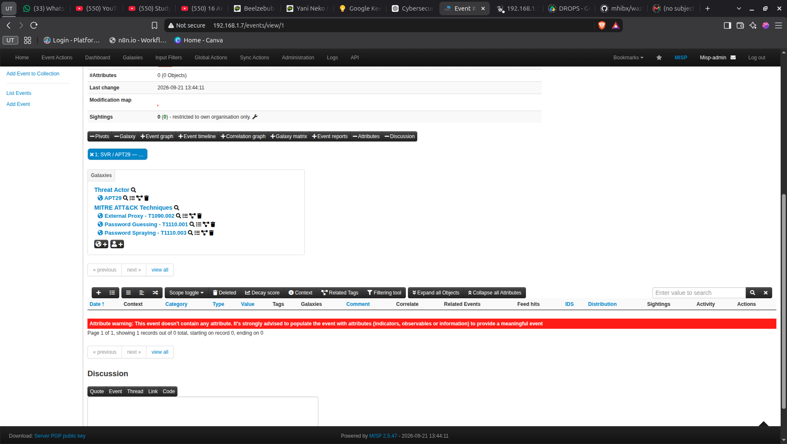
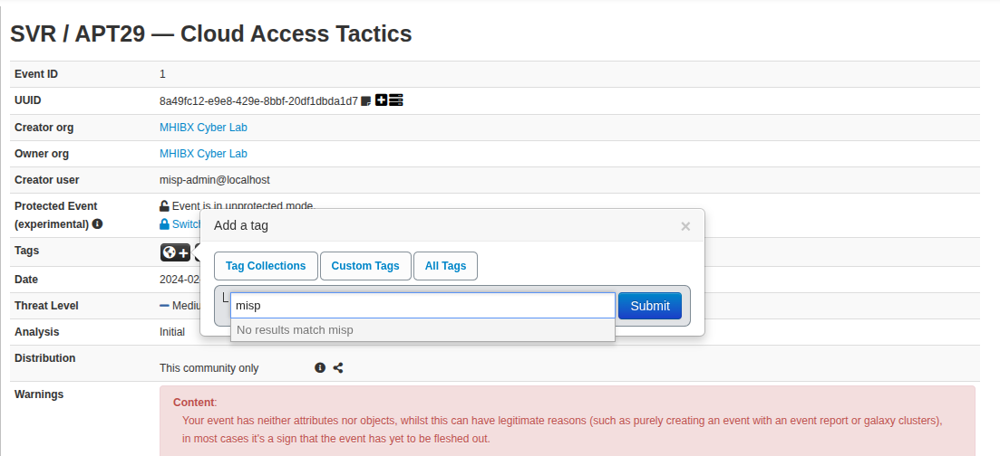
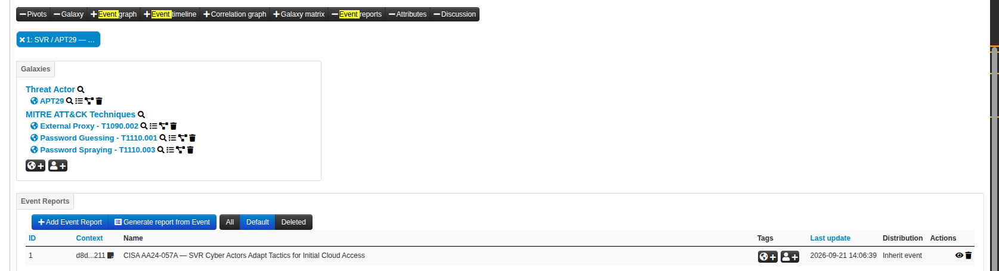
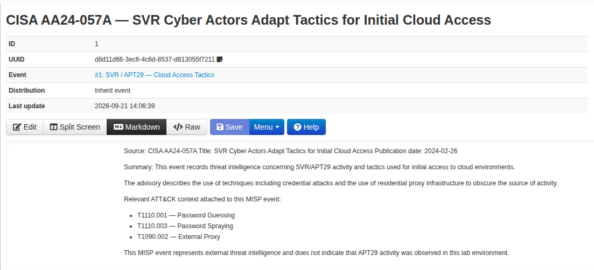
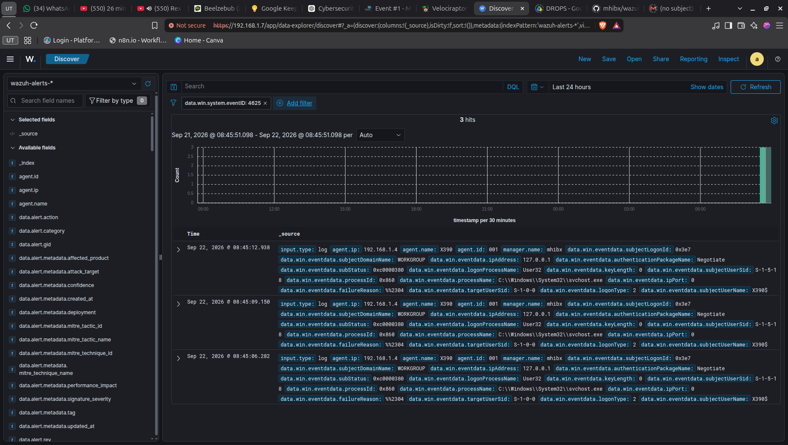
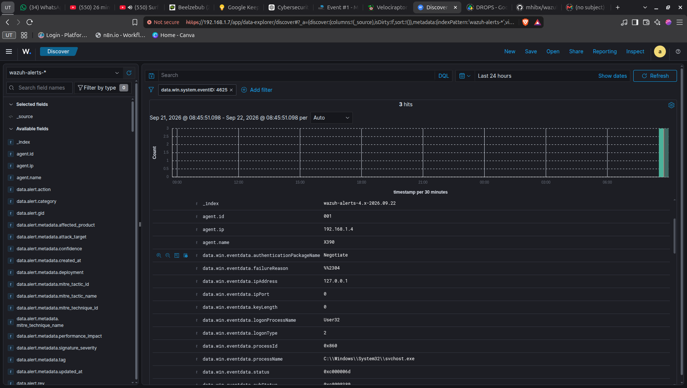
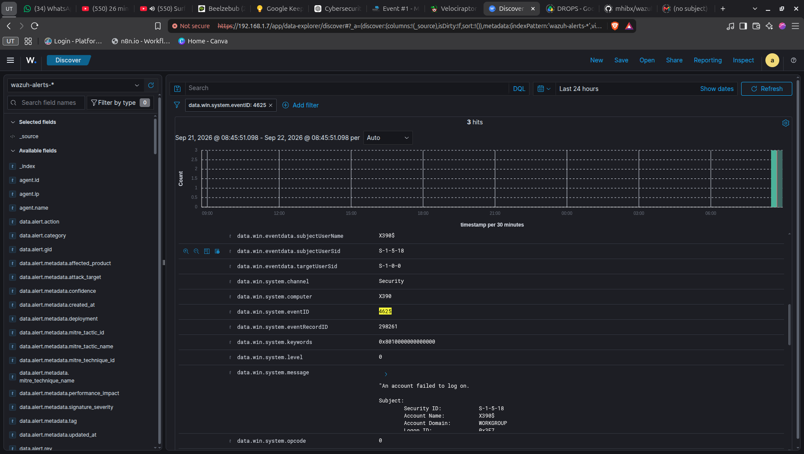
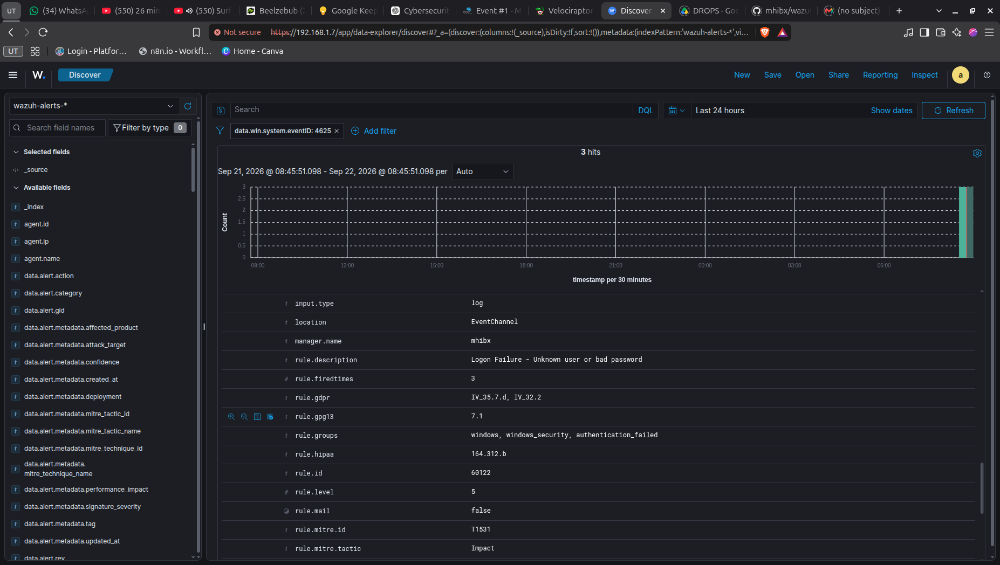

# MISP Threat Intelligence Lab — Case 01

## SVR / APT29 — Cloud Access Tactics

> **Case type:** Threat Intelligence / CTI  
> **Environment:** Local cybersecurity homelab  
> **Platforms:** MISP + Wazuh  
> **Status:** Completed

---

## 1. Overview

This case documents a practical Threat Intelligence exercise using MISP to model publicly available intelligence concerning SVR/APT29, then using that intelligence to formulate a threat-hunting hypothesis in Wazuh.

The purpose of the exercise was **not** to simulate or claim an APT29 intrusion into the lab.

Instead, the workflow was:

```text
Public Threat Intelligence
        ↓
MISP Event
        ↓
Threat Actor + ATT&CK TTP context
        ↓
Threat Hunting Hypothesis
        ↓
Wazuh Telemetry
        ↓
Contextual Analysis
        ↓
Assessment
```

The exercise demonstrates how CTI can support SOC investigations without treating threat intelligence as proof of attribution.

---

## 2. Objectives

- Understand the basic MISP data model through a practical case.
- Create a MISP Event from a public threat intelligence source.
- Associate a threat actor using MISP Galaxy.
- Associate relevant MITRE ATT&CK technique clusters.
- Record the source as an Event Report.
- Translate CTI into a threat-hunting hypothesis.
- Search Wazuh for authentication-failure telemetry.
- Distinguish observed telemetry from threat attribution.
- Document a case where the available telemetry does **not** substantiate the original threat hypothesis.

---

## 3. Threat Intelligence Source

**Source:** CISA AA24-057A — *SVR Cyber Actors Adapt Tactics for Initial Cloud Access*  
**Publication date:** 2024-02-26

The MISP Event was created to represent threat intelligence concerning SVR/APT29 activity and tactics related to initial access to cloud environments.

The Event Report records the CISA advisory as the source for the case.

---

## 4. MISP Event

### Event Information

| Field | Value |
|---|---|
| Event ID | 1 |
| Info | `SVR / APT29 — Cloud Access Tactics` |
| Date | `2024-02-26` |
| Threat Level | Medium |
| Analysis | Initial |
| Distribution | This community only |
| Published | No |
| Creator Organization | MHIBX Cyber Lab |

### Threat Actor

The Event is associated with the MISP Galaxy cluster:

- **APT29**



This association represents the threat intelligence subject of the Event. It does **not** indicate that APT29 activity was observed in the lab.

### MITRE ATT&CK Context

The Event contains the following ATT&CK technique clusters:

- **T1110.001 — Password Guessing**
- **T1110.003 — Password Spraying**
- **T1090.002 — External Proxy**



These techniques provide behavioral context for the threat intelligence and form the basis for the hunting hypothesis.

### Event Report

The Event contains an Event Report:

**CISA AA24-057A — SVR Cyber Actors Adapt Tactics for Initial Cloud Access**





The report records the source, publication date, summary, relevant ATT&CK context, and an explicit distinction between external CTI and activity actually observed in the lab.

---

## 5. Why No IOC Attributes Were Added

The Event currently contains **0 Attributes / 0 Objects**.

This was intentional.

The exercise focused on threat actor and TTP context rather than inventing or forcing IP addresses, domains, hashes, or other indicators that were not supported by the source material used for this case.

The MISP warning about an Event without Attributes/Objects was therefore left unresolved intentionally.

This demonstrates an important CTI principle:

> Threat intelligence is not limited to IOC feeds. Intelligence can also describe threat actors, techniques, campaigns, relationships, and behavioral context.

---

## 6. Threat Hunting Hypothesis

The MISP Event was used to formulate the following hypothesis:

> Authentication telemetry in the environment may contain patterns consistent with credential attack activity, particularly repeated authentication failures associated with password guessing or password spraying.

The hypothesis was deliberately phrased as a possibility rather than an assumption.

The presence of APT29 intelligence in MISP does **not** mean that APT29 is present in the environment.

---

## 7. Wazuh Investigation

### Data Source

The investigation used Windows Security Event ID:

```text
4625 — An account failed to log on
```

The telemetry was collected from the Windows X390 agent through Wazuh.

### Observed Wazuh Context

| Field | Observed value |
|---|---|
| Agent name | `X390` |
| Agent ID | `001` |
| Agent IP | `192.168.1.4` |
| Windows Event ID | `4625` |
| Authentication package | `Negotiate` |
| Logon Type | `2` |
| Source IP | `127.0.0.1` |
| Target account | `X390$` |
| Process | `C:\Windows\System32\svchost.exe` |
| Wazuh Rule ID | `60122` |
| Rule description | `Logon Failure - Unknown user or bad password` |
| Rule fired count in displayed result | `3` |

### Observed Events

Three Event ID 4625 records were observed in Wazuh around:

```text
2026-09-22 08:45:06
2026-09-22 08:45:09
2026-09-22 08:45:12
```



The detailed event context was reviewed in Wazuh:



Additional event fields included the Windows Security channel, Event ID 4625, event record information, and the event message:



The event was processed by Wazuh Rule `60122`:



---

## 8. Analysis

The observed telemetry confirms that authentication failures were recorded by Windows and ingested into Wazuh.

However, the available evidence does **not** establish:

- Password Guessing (T1110.001)
- Password Spraying (T1110.003)
- APT29 activity
- External credential attack activity

### Local Source

The observed source address was:

```text
127.0.0.1
```

This indicates local activity on the Windows workstation rather than an observed remote source.

### Target Account

The displayed target account was:

```text
X390$
```

This is a workstation computer account rather than evidence of an attacker targeting multiple user accounts.

### Number of Events

Three authentication failures are sufficient to demonstrate authentication-failure telemetry, but they are not by themselves enough to establish a password-guessing or password-spraying pattern.

For example:

```text
Password Guessing
→ repeated attempts against a target account

Password Spraying
→ attempts distributed across multiple accounts
```

The captured telemetry does not provide sufficient evidence for either classification.

---

## 9. Assessment

### Finding

**Authentication failure activity was observed, but the available telemetry did not substantiate the MISP-derived T1110.001/T1110.003 hypothesis.**

There was also no evidence in this exercise that the observed activity was caused by APT29.

The analytical conclusion is:

```text
CTI hypothesis
      ↓
4625 telemetry observed
      ↓
Context reviewed
      ↓
Hypothesis not substantiated
      ↓
No APT29 attribution
```

This is an example of CTI being used as an **investigative hypothesis**, rather than as an attribution mechanism.

---

## 10. Key Lessons Learned

### 10.1 MISP is not a Detection Sensor

MISP stores and contextualizes threat intelligence. It does not independently prove that a threat actor is active in the environment.

### 10.2 Galaxy Context is Not Attribution Evidence

Attaching the APT29 Galaxy cluster to an Event means the Event concerns intelligence about APT29. It does not mean that an alert involving a related technique is automatically attributable to APT29.

### 10.3 ATT&CK Technique ≠ Automatic Detection

Seeing Event ID 4625 does not automatically mean T1110.001 or T1110.003 occurred.

The analyst must examine the surrounding behavior and context.

### 10.4 Threat Intelligence Can Produce Negative Hunting Results

A valid hunting outcome can be:

> No sufficient evidence observed.

The absence of supporting evidence is itself useful investigative information.

### 10.5 CTI and SIEM Have Complementary Roles

```text
MISP
"What do we know about threats and their behavior?"

        ↓

Threat Hunting Hypothesis

        ↓

Wazuh
"What evidence do we actually observe in our environment?"
```

---

## 11. Limitations

This exercise has several limitations:

- The MISP Event represents external threat intelligence, not an observed intrusion.
- The Wazuh evidence was generated as controlled lab telemetry.
- The observed authentication failures were local and did not reproduce a complete password-guessing or password-spraying scenario.
- No IOC attributes were added to the MISP Event because no suitable source-supported IOC set was established for this case.
- The exercise does not establish any relationship between the observed Windows events and APT29.

---

## 12. Conclusion

This case demonstrates a basic CTI-enriched SOC workflow:

```text
CISA Threat Intelligence
        ↓
MISP Event
        ↓
APT29 + ATT&CK TTP context
        ↓
Threat Hunting Hypothesis
        ↓
Wazuh Windows Telemetry
        ↓
Contextual Investigation
        ↓
Hypothesis Not Substantiated
```

The main lesson is that **threat intelligence should guide investigation, while telemetry and evidence determine what can actually be concluded about the environment**.

---

## Evidence

All relevant screenshots are embedded throughout this case report and are also retained in the `screenshots/` directory.
